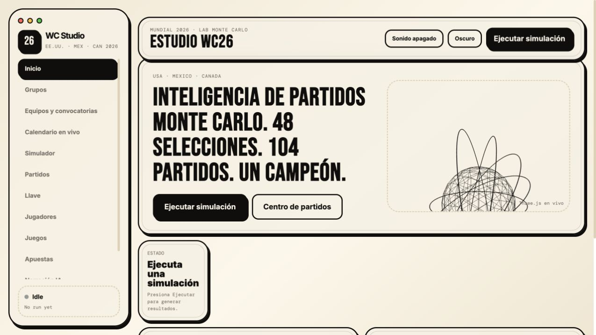
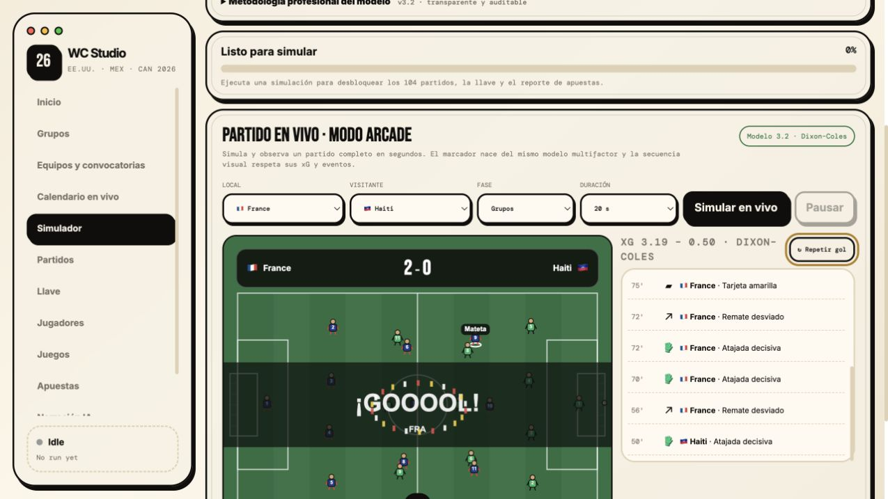

# WC26 Studio

Simulador profesional del Mundial 2026 con Monte Carlo, modelo estadístico multifactor y partidos arcade 2D.



## Características

- 48 selecciones y 104 partidos.
- Modelo con ELO, ranking FIFA, forma, plantilla, lesiones, historia, confederación y población.
- Marcadores Poisson con corrección Dixon–Coles.
- Simulación Monte Carlo en Web Worker.
- Partido visual arcade con 22 jugadores, pases, disparos, atajadas, goles y repeticiones.
- Probabilidades de campeón, equipo revelación y premios individuales.
- Retratos de jugadores con identidad estable, caché y fallback seguro.

## Partido arcade 2D

Los resultados nacen del modelo estadístico y se representan como un partido acelerado con 22 jugadores, posesión, pases, disparos, atajadas, goles y repetición instantánea.



## Ejecutar localmente

No requiere instalación ni compilación.

```bash
python3 -m http.server 8080
```

Después abre [http://127.0.0.1:8080](http://127.0.0.1:8080).

## Metodología

La aplicación genera estimaciones probabilísticas, no resultados garantizados. La metodología y sus fuentes se muestran dentro del simulador.
